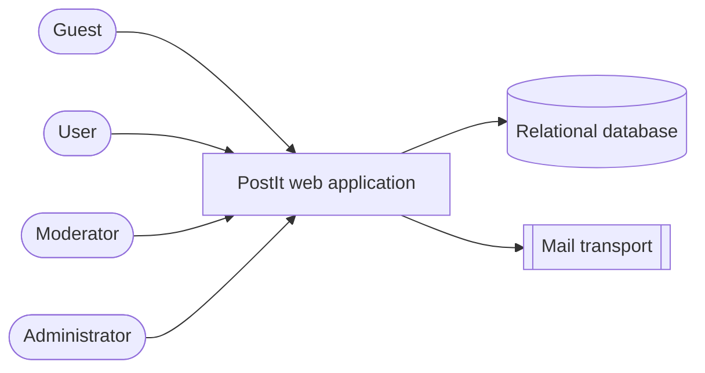
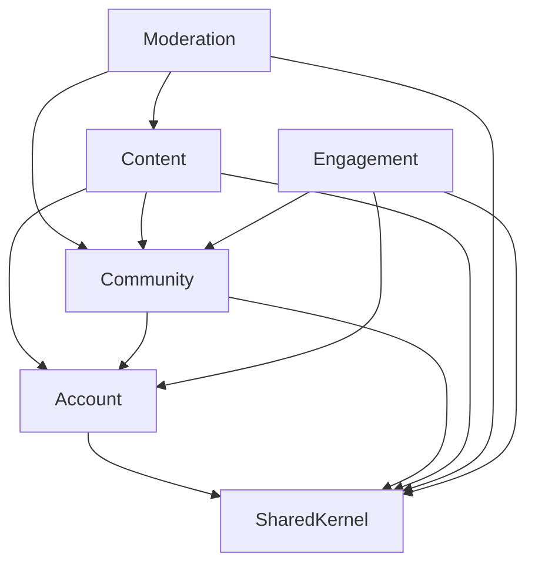
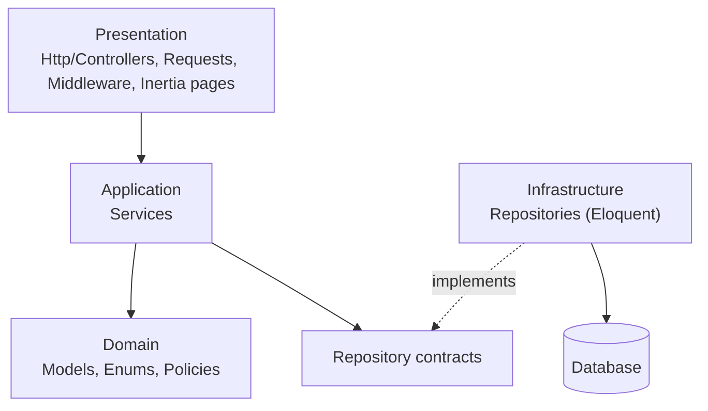
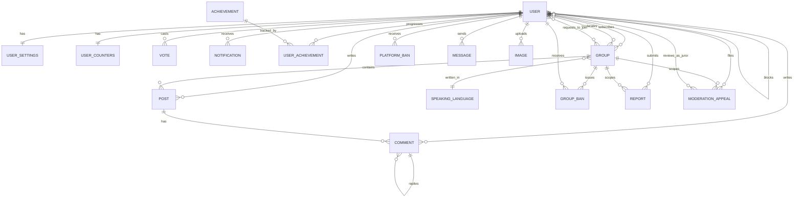
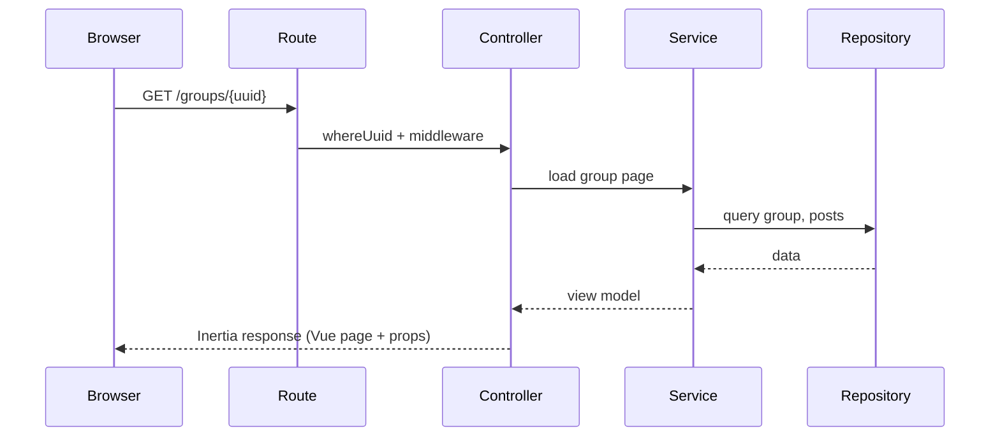
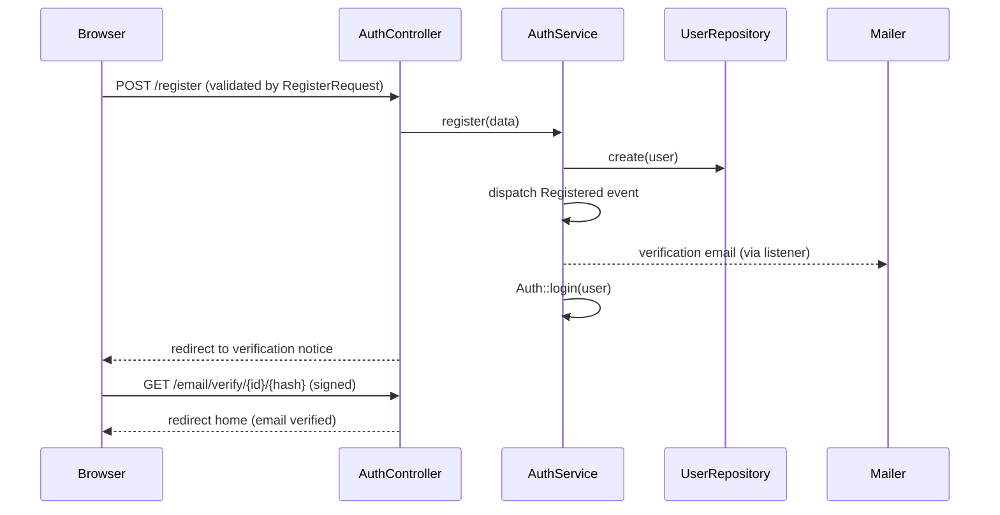

# Architecture Description — PostIt

| | |
|---|---|
| Document | Architecture Description (style: ISO/IEC/IEEE 42010:2022) |
| Version | 0.1.1 |
| Status | Draft |
| Last update | 2026-09-26 |
| Owner | Project owner (Mykola Poberezhnyi) |

## 1. Introduction

### 1.1 Purpose and scope
This document describes the architecture of **PostIt**: a community discussion platform (groups, posts, comments, votes, moderation, achievements). It covers the whole web application: backend, frontend, database and their runtime interaction. It relates to the [requirements specification](../specification/requirements_specification.md) and the [project policy](../project_policy.md).

### 1.2 Stakeholders and concerns

| Stakeholder | Concerns |
|---|---|
| Users / guests | Fast pages, correct access to content, privacy of private groups |
| Moderators / administrators | Reliable moderation tools, auditable sanctions |
| Developers | Clear module boundaries, testability, low coupling between layers |
| Project owner | Maintainability, documentation quality, secure development |
| Course reviewer | Traceability from requirements to architecture and code |

### 1.3 Architecture viewpoints used

| Viewpoint | Frames concerns | View |
|---|---|---|
| Context | Scope and external actors | §2 |
| Module (logical) | Decomposition, dependencies, boundaries | §3 |
| Data | Entities and relations | §4 |
| Runtime | How a request flows through layers | §5 |
| Development | Repository and folder organisation | §6 |
| Security | Trust boundaries and protections | §7 |

## 2. Context view



- Actors use the application through a browser.
- The application persists everything in one relational database and sends verification / reset emails through the Laravel mailer.
- No other external systems are integrated (see scope, specification §1.2).

## 3. Module view

### 3.1 Bounded contexts



Responsibilities and boundaries of every module are in the [module registry](../modules.md) and each `docs/modules/<Module>/business_logic.md`.

### 3.2 Layers



- Dependencies point downwards; infrastructure implements contracts owned by the application layer (dependency inversion).
- The frontend (Vue) sits in the Presentation layer and talks to the backend only through Inertia responses and form submissions.

### 3.3 Technology stack

| Concern | Technology |
|---|---|
| Backend framework | Laravel 13 (PHP 8.3+) |
| Server ↔ client bridge | Inertia.js 3 (`inertia-laravel`, `@inertiajs/vue3`) |
| Frontend | Vue 3, Tailwind CSS 4, Vite (`laravel-vite-plugin`) |
| Named routes in JS | Ziggy |
| Code style / tests | Laravel Pint / PHPUnit 12 |

## 4. Data view



Data conventions:
- Primary keys are UUIDs; link tables use composite primary keys (`user_group_subscriptions`, `group_moderators`, `group_join_requests`, `votes`, `group_bans`, …).
- `votes`, `reports` and `images` reference their target polymorphically through `*_type` (integer) and an id column; integrity is checked in the application layer.
- Post and comment deletion is soft (`is_deleted`, `deleted_at`).
- Ownership of tables by module is described in each module's `business_logic.md`.
- *(0.1.1, planned)* `group_moderators.role` distinguishes `Owner` (permanent) from `Guardian` (community-elevated, decaying); a Guardian's candidacy and standing, and a filed appeal with its jurors' blind votes, are new entities described in `Community`/`Moderation` `business_logic.md` — not yet reflected in migrations.

## 5. Runtime view

### 5.1 Page request (public read)



*Current state:* the Group and Post pages receive only the `id` and read dummy data on the client; the Service/Repository part of this flow is planned.

### 5.2 Registration and email verification (implemented)



## 6. Development view

```
PostIt/
├── app/                 # Http, Services, Repositories, Models, (Enums, Policies planned)
├── bootstrap/           # app.php: routing, middleware, exception rendering
├── config/
├── database/            # migrations, factories, seeders
├── docs/                # this documentation
├── public/
├── resources/
│   ├── css/             # Tailwind entry + component classes
│   └── js/              # app.js, Layouts/, Pages/, Pages/Components/, data/ (temporary), utils/
├── routes/              # web.php, console.php
├── tests/               # mirrors app/
├── composer.json, package.json, vite.config.js
└── README.md
```

Workflow: `main` + short-lived task branches, pull requests, commit prefix `[TYPE]`; checks before merge: Pint and tests (project policy §11).

## 7. Security view

| Trust boundary | Protection |
|---|---|
| Browser → server | CSRF token, session cookies, Form Request validation, throttling on auth mail endpoints |
| Guest vs. user | `guest` / `auth` middleware; email verification for verified-only actions |
| User vs. group | Authorization policies (membership, moderator role, active bans) enforced server-side |
| Data at rest | Hashed passwords; secrets only in `.env` |
| Data in transit to client | Only whitelisted props are shared through Inertia; no tokens or emails of other users |
| Account enumeration | Identical responses for reset requests and failed logins |

Aligned with the intent of NIST SP 800-218 (SSDF): validate inputs, protect secrets, keep dependencies pinned in lock files, verify with tests before release.

## 8. Correspondences

| Requirement group | Architecture element |
|---|---|
| FR-ACC-* | `Account` module — `AuthController`, `AuthService`, `UserRepositoryInterface` |
| FR-COM-* | `Community` module — group models, planned membership/join services, `Groups/Show.vue` |
| FR-CON-* | `Content` module — `Post`, `Comment`, `Vote`, `PostCard`, `CommentNode`, `Posts/Show.vue` |
| FR-MOD-* | `Moderation` module — `Report`, `GroupBan`, `PlatformBan` |
| FR-ENG-* | `Engagement` module — `Achievement`, `Notification`, notification/inbox menus |
| NFR-SEC-* | §7 Security view; policy §3, §8 |
| NFR-MNT-* | Policy §10–§12 |

## 9. Architecture decisions and rationale

| # | Decision | Rationale | Consequence |
|---|---|---|---|
| AD-1 | Laravel + Inertia + Vue instead of separate SPA + API | One deployable unit, server-side routing and auth, no duplicated validation | Frontend coupled to Laravel; a public API would be a separate addition |
| AD-2 | Layered structure with Services and Repository contracts | Testable business logic independent of HTTP and Eloquent | Some boilerplate for simple CRUD |
| AD-3 | Modules as bounded contexts documented in `docs/modules` | Clear ownership; low coupling | Physical folder-per-module is optional and can be introduced gradually |
| AD-4 | UUID primary keys everywhere | Non-guessable ids, safe in URLs | Slightly larger indexes |
| AD-5 | Composite primary keys on link tables | Guarantees uniqueness (e.g. one vote per user per target) | Eloquent has no native support; access through relations or dedicated handling (see tech notes) |
| AD-6 | Polymorphic targets via integer type + id | One `votes` / `reports` table for posts and comments | No FK on the target; application must guard integrity; needs a shared `TargetType` enum |
| AD-7 | Soft deletion by flags | Keeps thread structure and audit trail | Queries must always filter deleted rows |
| AD-8 | Dummy frontend data during early development | UI can be built before backend endpoints | Must be removed per module as endpoints appear (anti-pattern #11) |
| AD-9 *(0.1.1)* | Group moderation power is split into two non-overlapping roles — a permanent `Owner` and a community-elevated, decaying `Guardian` — with a Guardian's individual actions reviewable only by an independent jury drawn platform-wide, never by a direct vote of the people it sanctions | Avoids both failure modes seen in comparable systems: an admin-appointed moderator nobody can remove, and direct crowd voting that lets a sanctioned majority overturn its own sanction (patterned after CS:GO's Overwatch review system: independent, blind, jury-based) | Needs new planned entities (`GuardianCandidacy`, `GuardianStanding`, `ModerationAppeal`, `AppealVote`) and a cross-module event flow between `Community` and `Moderation`; several tuning parameters are intentionally left open (see module `tech_notes.md`) |

## 10. Known risks

- Access rules for private groups and bans exist only in the UI/model level for now — server-side enforcement is required before release.
- Composite keys on Eloquent models need careful handling (see tech notes).
- *(0.1.1)* The Guardian/Owner model is designed but not yet implemented; several numeric parameters (score thresholds, decay windows, warning periods) are explicitly undecided and need real usage data before they can be fixed.
