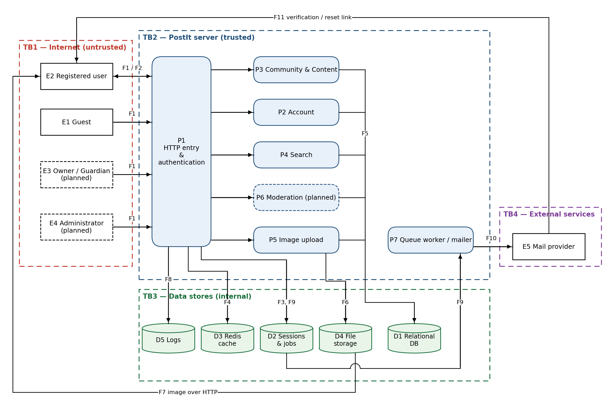

# Threat Model — PostIt

| | |
|---|---|
| Name | Threat Model — PostIt |
| Version | 0.1.0 |
| Status | Draft |
| Classification | Internal |
| Methodology | STRIDE per element (simplified), data flow diagram |
| Last update | 2026-10-05 |
| Owner | Project owner (Mykola Poberezhnyi) |

> One threat model covers the whole application: PostIt is one deployable Laravel + Inertia + Vue unit with one database, so splitting it per module would repeat the same boundaries. Rules that answer the threats are in the [security policy](security_policy.md); personal data handling is in the [privacy policy](privacy_policy.md). The state of every control reflects the code on the date above.

## 1. Scope

**In scope:** the PostIt web application (routes, middleware, controllers, services, policies, repositories), its data stores (relational database, Redis cache, public file storage, logs, sessions and queue tables), the queue worker that sends email, the external mail provider, and the browser-side Vue pages.

Covers implemented features (registration, login, email verification, password reset, profile and avatar, settings, follows, groups and subscriptions, posts, comments, votes, shares, feed, search) and **planned** features already designed in module docs (moderation: reports, group/platform bans, Guardian/Owner roles; administrators; direct messages; image screening). Planned elements are marked *(planned)*.

**Out of scope:** the hosting provider's physical and network infrastructure, the user's own device and browser, the GitHub platform itself (development environment rules are in the security policy §5).

**Assets to protect:** user accounts and sessions; passwords (hashes), emails and dates of birth; private-group posts; integrity of votes, memberships and sanctions; uploaded images; availability of the site; secrets in `.env`.

## 2. Data flow diagram

Dashed boxes are trust boundaries TB1–TB4; dashed elements are planned. F1–F11 are the data flows listed in §2.1.

Logical trust boundaries inside TB2 (enforced by middleware and Policies, not by the network):

| Boundary | Separates | Enforced by |
|---|---|---|
| TB-A | Guest ↔ authenticated user | `auth` / `guest` middleware |
| TB-B | Unverified ↔ verified user | `hasVerifiedEmail()` in Policies |
| TB-C | Non-member ↔ member of a private group | `ChecksGroupVisibility`, `PostPolicy::create()` |
| TB-D | User ↔ group staff ↔ administrator *(planned)* | `ReportPolicy`, `BanPolicy` *(planned)*, `users.role` |

### 2.1 Elements

| ID | Element | Type |
|---|---|---|
| E1 | Guest (unauthenticated browser) | External entity |
| E2 | Registered user (browser) | External entity |
| E3 | Group Owner / Guardian *(planned)* | External entity |
| E4 | Platform administrator *(planned)* | External entity |
| E5 | Mail provider (SMTP) | External entity |
| P1 | HTTP entry and authentication — routing, session, CSRF, throttle, `SetLocale`, `AuthController`/`AuthService` | Process |
| P2 | Account — `ProfileController`, `SettingsService`, `FollowService` | Process |
| P3 | Community & Content — `GroupService`, `MembershipService`, `PostService`, `CommentService`, `VoteService`, feed | Process |
| P4 | Search — `SearchController`, `SearchService`, `SearchesText` | Process |
| P5 | Image upload — `ImageService`, `UpdateAvatarRequest` | Process |
| P6 | Moderation *(planned)* — `ReportService`, `GroupBanService`, `PlatformBanService` | Process |
| P7 | Queue worker and mailer | Process |
| D1 | Relational database (MySQL; SQLite in tests) | Data store |
| D2 | `sessions`, `jobs`, `failed_jobs` tables | Data store |
| D3 | Redis cache (`CACHE_STORE=redis`) | Data store |
| D4 | `storage/app/public` served via `public/storage` | Data store |
| D5 | `storage/logs` | Data store |

| Flow | From → To | Data | Crosses |
|---|---|---|---|
| F1 | E1–E4 → P1 | HTTP requests: credentials, form/JSON input, files, cookies | TB1 → TB2 |
| F2 | P1 → E2 | HTML, Inertia props, JSON, session/XSRF cookies | TB2 → TB1 |
| F3 | P1 ↔ D2 | Session payload, user id, IP, user-agent | TB2 → TB3 |
| F4 | P1 ↔ D3 | Rate-limit counters | TB2 → TB3 |
| F5 | P2–P6 ↔ D1 | SQL queries and results | TB2 → TB3 |
| F6 | P5 → D4 | Uploaded image file | TB2 → TB3 |
| F7 | D4 → E2 | Image over HTTP (`/storage/...`) | TB3 → TB1 |
| F8 | P1 → D5 | Log records | TB2 → TB3 |
| F9 | P1 → D2 → P7 | Queued mail job | TB2 ↔ TB3 |
| F10 | P7 → E5 | Email (SMTP) with signed link | TB2 → TB4 |
| F11 | E5 → E2 | Verification / reset email in the user's mailbox | TB4 → TB1 |

### 2.2 STRIDE categories checked per element type

| Element type | S | T | R | I | D | E |
|---|---|---|---|---|---|---|
| External entity | ✓ | | ✓ | | | |
| Process | ✓ | ✓ | ✓ | ✓ | ✓ | ✓ |
| Data store | | ✓ | | ✓ | ✓ | |
| Data flow | | ✓ | | ✓ | ✓ | |

S — Spoofing, T — Tampering, R — Repudiation, I — Information disclosure, D — Denial of service, E — Elevation of privilege.

## 3. Intruder model

| ID | Intruder | Initial access | Capabilities | Interfaces available |
|---|---|---|---|---|
| N1 | External anonymous attacker / bot | None, internet access only | Scripts and automated tools, many IPs, guessing URLs and passwords, crafted HTTP requests | All public routes (feed, groups, posts, search, login, register, reset) |
| N2 | Registered, unverified user | Own account, email not confirmed | As N1 plus an authenticated session | Settings, profile, logout, resend verification |
| N3 | Legitimate verified user acting maliciously | Own verified account, member of some groups | Posts, comments, votes, uploads, reports; can create several accounts with different emails | All `auth` routes; content of groups they joined |
| N4 | Group Owner / Guardian *(planned)* | Moderator role in one group | Ban users and remove content in their group | Moderation endpoints of that group |
| N5 | Administrator *(planned)* or someone with a stolen admin account | Platform-wide moderation rights | Platform bans, escalated reports | Administration endpoints |
| N6 | Network attacker | Same Wi-Fi / network path as a user | Sniff or modify unencrypted traffic | F1, F2, F10, F11 |
| N7 | Attacker with access to server or backups | Leaked credentials, backup copy, compromised host | Read/modify files, database, logs | D1–D5 directly |
| N8 | Supply-chain attacker | Control over a Composer/npm package | Malicious code runs inside P1–P7 | Dependencies installed from lock files |

## 4. Threats

Status: **Mitigated** — control exists in code; **Partial** — control exists but has a gap; **Open** — no control yet; **Planned** — the feature itself is not built, the control is designed; **Accepted** — the risk is accepted on purpose. Risk: H / M / L.

### 4.1 External entities

| ID | Element | STRIDE | Threat scenario | Intruder | Existing controls | Status | Risk |
|---|---|---|---|---|---|---|---|
| T-01 | E2 | S | Attacker guesses or reuses (credential stuffing) a user's password through `POST /login` with unlimited attempts. | N1 | bcrypt hashes, generic "invalid credentials" error, min 8 chars | **Open** — `/login` has no throttle | H |
| T-02 | E2 | S | Someone registers with another person's email and acts as them. | N1 | Email verification required for any content action (`hasVerifiedEmail()` in Policies) | Mitigated | L |
| T-03 | E2 | R | A user denies having posted, commented, voted or reported. | N3 | Every record stores `user_id` and timestamps; posts/comments are soft-deleted, not erased | Mitigated | L |
| T-04 | E3 | R | A Guardian denies issuing a ban or removing content. | N4 | `group_bans.moderator_id`, `reason`, timestamps; `reports.reviewed_by`, `resolution_note` | Planned | M |
| T-05 | E4 | S | Attacker takes over an administrator account (phishing, password reuse) and gets platform-wide power. | N1, N5 | Same password login as users only | **Open** (planned role) | H |
| T-06 | E5 | S | Attacker sends phishing emails that look like PostIt verification/reset mails, or uses leaked SMTP credentials to send them from our domain. | N1, N7 | SMTP credentials only in `.env` | Partial — no SPF/DKIM/DMARC yet | M |

### 4.2 Processes

**P1 — HTTP entry and authentication**

| ID | STRIDE | Threat scenario | Intruder | Existing controls | Status | Risk |
|---|---|---|---|---|---|---|
| T-07 | S | Session cookie is stolen (XSS, open network) and reused to act as the victim. | N1, N6 | Cookies `HttpOnly`, `SameSite=Lax`; session regenerated on login, invalidated on logout | Partial — `Secure` flag/HTTPS not configured yet | H |
| T-08 | S | Session fixation: attacker plants a session id before the victim logs in. | N1 | `session()->regenerate()` after successful login | Mitigated | L |
| T-09 | T | CSRF: a foreign site makes the victim's browser vote, post, follow or change settings. | N1 | CSRF middleware on all `web` routes, `X-XSRF-TOKEN` in JSON helpers, `SameSite=Lax`, no state change by `GET` | Mitigated | L |
| T-10 | T | Clickjacking: PostIt is loaded in an invisible frame and the user is tricked into clicking vote/subscribe/delete. | N1 | — | **Open** — no `X-Frame-Options` / CSP `frame-ancestors` | M |
| T-11 | R | Brute force, failed authorizations or abuse leave no trace, so an attack can't be investigated. | N1, N3 | Laravel error log only | **Open** — no security event logging | M |
| T-12 | I | Account enumeration: attacker learns which emails are registered. | N1 | Identical answers for login failure and reset requests | Partial — registration says "email already taken" (accepted for usability) | L |
| T-13 | I | Stack traces, SQL and `.env` values are shown in error pages. | N1 | `APP_DEBUG=false` required in production; JSON errors only for `api/*` and JSON requests | Mitigated (by configuration) | M |
| T-14 | D | Bots mass-register accounts; every registration sends a verification email (mail quota, reputation). | N1 | Unique email, verification resend throttled 6/min | **Open** — `/register` has no throttle or CAPTCHA | M |
| T-15 | E | Unverified user creates content by calling endpoints directly. | N2 | Policies check `hasVerifiedEmail()`; verification link is signed | Mitigated | L |
| T-16 | E | A compromised Composer/npm dependency runs malicious code inside the application. | N8 | `composer.lock`/`package-lock.json` committed; packages from official registries | Partial — no automated `audit`/Dependabot in a pipeline yet | M |

**P2 — Account**

| ID | STRIDE | Threat scenario | Intruder | Existing controls | Status | Risk |
|---|---|---|---|---|---|---|
| T-17 | S | User follows themselves or follows as another user. | N3 | `FollowService` refuses self-follow; follower is always the session user | Mitigated | L |
| T-18 | T | IDOR: user changes another user's profile, settings or avatar by sending their id. | N3 | `PATCH /profile`, `/settings`, `/profile/avatar` act only on `$request->user()`, no id in the route | Mitigated | L |
| T-19 | R | User claims a setting (e.g. adult content) was changed without their action. | N3 | — | Accepted — low impact, settings are user-owned | L |
| T-20 | I | Other users' email, date of birth or settings reach the browser through Inertia props or JSON. | N1, N3 | Shared props whitelist `id`, `username`, `avatar_url`; API Resources (`UserProfileResource`) expose public fields only | Mitigated | M |
| T-21 | I | Uploaded avatar photo keeps EXIF metadata (GPS location, device) visible to everyone. | N1 | — | **Open** — files are stored as uploaded, no re-encoding | M |
| T-22 | D | A user floods profile/settings updates. | N3 | `throttle:30,1` on profile/settings, `10,1` on avatar | Mitigated | L |
| T-23 | E | A minor enables adult content by sending `show_adult_content=true` directly. | N3 | `UpdateSettingsRequest` rule + `SettingsService` guard on `isAdult()` | Mitigated; date of birth is self-declared (Accepted) | M |

**P3 — Community & Content**

| ID | STRIDE | Threat scenario | Intruder | Existing controls | Status | Risk |
|---|---|---|---|---|---|---|
| T-24 | S | User posts into a group where they are not a member by sending a crafted `group_id` to `POST /posts`. | N3 | `PostPolicy::create()`: verified + member + not banned, checked against the loaded group | Mitigated (feature tests) | M |
| T-25 | T | Stored XSS through post Markdown or comment text. | N3 | Vue escapes output; Markdown rendered with `html_input: strip`, `allow_unsafe_links: false`; `v-html` only for that output | Mitigated | H |
| T-26 | T | Vote manipulation: voting on own content, voting twice, or using several accounts. | N3 | One vote per user per target (composite PK), `PostPolicy::vote()` forbids own content, verified email needed | Partial — multiple accounts are not detected | M |
| T-27 | T | SQL injection through search terms, sort or filter parameters. | N1 | Query builder bindings, `SearchesText::escapeLike()`, sort/period/type parsed into enums with safe fallback | Mitigated | H |
| T-28 | R | A user claims their post was changed by someone else. | N3 | No edit feature; author and timestamps stored | Mitigated | L |
| T-29 | I | Outsider reads a private group's posts by URL, random-post link, search, author profile or feed. | N1, N3 | `ChecksGroupVisibility::canSeePostsOf()`, 404 instead of 403, visibility filter in feed/search/profile queries | Mitigated (feature tests) | H |
| T-30 | I | Who voted on a post is revealed. | N3 | Only totals are sent to the client | Mitigated | L |
| T-31 | D | Bot floods posts, comments, votes or shares. | N3 | `throttle:60,1` on write endpoints; pagination of feeds and comment threads | Partial — limits depend on Redis (see T-46) | M |
| T-32 | E | A user banned from a group keeps posting, commenting or voting there. | N3 | `ChecksGroupBans` in `PostPolicy`, `CommentPolicy`, `GroupPolicy::subscribe()` | Mitigated | M |
| T-33 | E | A user banned from the whole platform keeps using it. | N3 | `platform_bans` table exists | **Open** — not checked by any Policy | H |

**P4 — Search**

| ID | STRIDE | Threat scenario | Intruder | Existing controls | Status | Risk |
|---|---|---|---|---|---|---|
| T-34 | I | Search results or suggestions show private-group posts or private user data. | N1 | Same visibility rule as feeds (`viewerId`), people results use public profile resource | Mitigated | M |
| T-35 | D | Many search requests with `LIKE '%term%'` (full scans) overload the database. | N1 | `throttle:60,1` (results) and `120,1` (suggest), term normalisation, small page sizes | Partial — no index for leading wildcard; Scout + Meilisearch planned | M |

**P5 — Image upload**

| ID | STRIDE | Threat scenario | Intruder | Existing controls | Status | Risk |
|---|---|---|---|---|---|---|
| T-36 | T / E | Uploading a PHP script or polyglot file disguised as an image to execute code on the server. | N3 | `image` + `mimes` checked by content; stored under a random UUID name with an extension guessed from contents; served only as static file | Mitigated | H |
| T-37 | T | Uploading illegal or adult content as an avatar visible to everyone. | N3 | Reports (planned) | **Open** — FR-MOD-013/014 planned | H |
| T-38 | D | Huge or decompression-bomb images fill the disk or exhaust memory. | N3 | Max 2 MB, max 4096×4096 px, `throttle:10,1`; old avatar file removed on replace | Mitigated | L |

**P6 — Moderation *(planned)***

| ID | STRIDE | Threat scenario | Intruder | Existing controls | Status | Risk |
|---|---|---|---|---|---|---|
| T-39 | E | A Guardian bans users or removes content outside their own group, or bans an administrator. | N4 | `BanPolicy` designed: own group only, nobody bans an admin | Planned | H |
| T-40 | T | Reporter or reported user changes a report's status, or a report is resolved without a note. | N3 | `ReportStatus` lifecycle, `resolution_note` required on close, only `ReportService` changes status | Planned | M |
| T-41 | I | The reported user learns who reported them and retaliates. | N3 | Reporter id is never shown to the reported user (design) | Planned | M |
| T-42 | S | A sanctioned majority overturns its own sanction by crowd voting. | N3 | No direct crowd vote; appeals go to a blind cross-group jury (AD-9) | Planned | M |

**P7 — Queue worker / mailer**

| ID | STRIDE | Threat scenario | Intruder | Existing controls | Status | Risk |
|---|---|---|---|---|---|---|
| T-43 | I | Personal data (emails, tokens) stays in `jobs`/`failed_jobs` payloads and exceptions. | N7 | Event payloads carry ids only (project policy §5) | Partial — `failed_jobs` is not pruned | L |
| T-44 | D | Queue worker stops; verification and reset emails are never sent. | N1 | `QUEUE_CONNECTION=database`, retries | Partial — no monitoring of the worker | L |

### 4.3 Data stores

| ID | Element | STRIDE | Threat scenario | Intruder | Existing controls | Status | Risk |
|---|---|---|---|---|---|---|---|
| T-45 | D1 | T / I | Attacker with database access (leaked credentials, SQL client exposed to the internet) reads emails/dates of birth or changes votes and sanctions. | N7 | Passwords hashed; credentials only in `.env` | Partial — least-privilege DB user and closed port are policy, not verified | H |
| T-46 | D1 | D | Database outage or full disk stops the site; data loss. | N1, N7 | — | Partial — backups required by policy, restore not tested | M |
| T-47 | D2 | T / I | Session rows (with IP and user-agent) are read or forged by someone with DB access, giving them a logged-in session. | N7 | Session payload is JSON-serialised, ids are random | Partial (same as T-45) | M |
| T-48 | D3 | T / D | Redis exposed without password: attacker resets rate-limit counters; or Redis is down and every throttled route fails (voting fails — known issue in Content tech notes). | N1, N7 | — | **Open** | M |
| T-49 | D4 | I / T | Avatar files are enumerated or overwritten. | N1 | Random UUID file names; avatars are public by design (Accepted for reading) | Mitigated | L |
| T-50 | D5 | I | Logs contain passwords, tokens or emails (e.g. from exceptions or validation input). | N7 | NFR-SEC-004; Laravel hides `password` fields in validation errors | Partial — no log review yet | M |
| T-51 | D5 | T / D | Attacker deletes logs to hide traces, or logs grow until disk is full. | N7 | — | Partial — `daily` rotation required by policy, current `LOG_STACK=single` | L |

### 4.4 Data flows

| ID | Element | STRIDE | Threat scenario | Intruder | Existing controls | Status | Risk |
|---|---|---|---|---|---|---|---|
| T-52 | F1/F2 | I / T | Credentials, session cookie or private content are read or changed on an unencrypted connection. | N6 | — (local development over HTTP) | **Open** for production — HTTPS + HSTS required | H |
| T-53 | F1 | D | Volumetric DDoS against the site. | N1 | Application throttles only | Accepted — handled at hosting/CDN level | M |
| T-54 | F7 | I | Image is served with a wrong content type and executed as HTML/script in the browser. | N3 | Only image types stored, extension from contents | Partial — no `X-Content-Type-Options: nosniff` | L |
| T-55 | F10/F11 | I / T | Reset link is read or changed on the way to the user's mailbox. | N6 | Signed verification URLs; reset tokens hashed in DB, expire in 60 min, one use | Partial — SMTP TLS depends on provider configuration | M |
| T-56 | F3/F4/F5 | I | Traffic between the app and DB/Redis is sniffed when they are on different hosts. | N6, N7 | Same host in current setup | Accepted while on one host; TLS required if moved | L |

## 5. Security requirements derived from the model

### 5.1 Requirements to the software (SR-SW)

| ID | Requirement | Threats |
|---|---|---|
| SR-SW-01 | `POST /login` shall be rate limited per email + IP (e.g. 5 attempts/min) and `POST /register` per IP (e.g. 3/min). | T-01, T-14 |
| SR-SW-02 | In production the site shall be served only over HTTPS with HSTS; session cookies shall be `Secure`, `HttpOnly`, `SameSite=Lax`. | T-07, T-52 |
| SR-SW-03 | Every response shall carry security headers: `X-Frame-Options: DENY` (or CSP `frame-ancestors 'none'`), `X-Content-Type-Options: nosniff`, `Referrer-Policy: strict-origin-when-cross-origin`, and a Content Security Policy limited to own origin. | T-10, T-25, T-54 |
| SR-SW-04 | Security events shall be logged without secrets: login failures over the limit, throttle hits, denied mutations, bans issued/lifted, administrator actions. | T-04, T-11 |
| SR-SW-05 | Active platform bans shall be checked by every Policy that allows a mutation, through one shared concern, with feature tests. | T-33 |
| SR-SW-06 | Administrator rights shall be granted only by `users.role` backed by an enum; administrator accounts shall use two-factor authentication. | T-05 |
| SR-SW-07 | Uploaded images shall be re-encoded or stripped of EXIF metadata before storing. | T-21 |
| SR-SW-08 | Uploaded images shall be screened for illegal/adult content (FR-MOD-013) and reportable (FR-MOD-014). | T-37 |
| SR-SW-09 | Moderation actions shall be limited to the moderator's own group; nobody can sanction an administrator; report status changes only through `ReportService`; reporter identity is never shown to the reported user. | T-39, T-40, T-41 |
| SR-SW-10 | Rate limiting shall keep working when the cache store is unavailable, or the failure shall be detected and reported. | T-31, T-48 |
| SR-SW-11 | Self-service account deletion shall remove or anonymise personal data by the cascade rules (NFR-PRV-001). | Privacy policy §9 |
| SR-SW-12 | `failed_jobs` shall be pruned regularly; job payloads shall carry ids only. | T-43 |

### 5.2 Requirements to the development process (SR-DEV)

| ID | Requirement | Threats |
|---|---|---|
| SR-DEV-01 | Every threat with status *Mitigated* that relies on an access rule shall have a feature test for the forbidden case. | T-15, T-18, T-24, T-29, T-32 |
| SR-DEV-02 | `composer audit` and `npm audit` shall run before every release; Dependabot alerts shall be enabled; a CI pipeline shall run Pint, tests and audits on every PR. | T-16 |
| SR-DEV-03 | Production configuration shall be checked before release: `APP_DEBUG=false`, `APP_ENV=production`, `SESSION_SECURE_COOKIE=true`, `LOG_STACK=daily`. | T-13, T-51, T-52 |
| SR-DEV-04 | The database user shall have rights only on the application schema; DB and Redis ports shall not be reachable from the internet; Redis shall require a password. | T-45, T-47, T-48 |
| SR-DEV-05 | Backups shall be encrypted and a restore shall be tested at least once per release. | T-46 |
| SR-DEV-06 | The mail domain shall have SPF, DKIM and DMARC; SMTP shall use TLS. | T-06, T-55 |
| SR-DEV-07 | Any new `v-html`, raw SQL, file type or external integration requires a threat model update and owner review. | T-25, T-27, T-36 |
| SR-DEV-08 | The threat model shall be reviewed when a planned element (P6, E3, E4, direct messages) is implemented. | T-04, T-39–T-42 |

## 6. Summary

| Status | Count |
|---|---|
| Mitigated | 22 |
| Partial | 16 |
| Open | 10 |
| Planned | 5 |
| Accepted | 3 |

Highest open risks before the first release: T-01 (login brute force), T-33 (platform bans not enforced), T-37 (image screening), T-52 (HTTPS). They are tracked with the other gaps as exceptions EX-1…EX-8 in the security policy.
